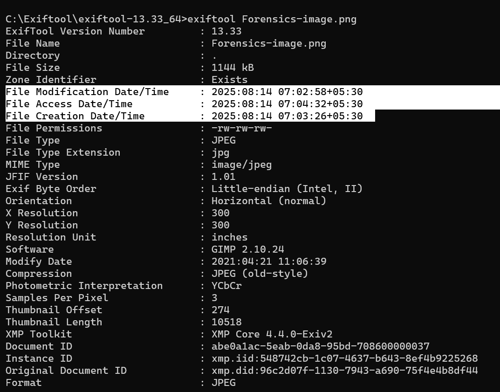
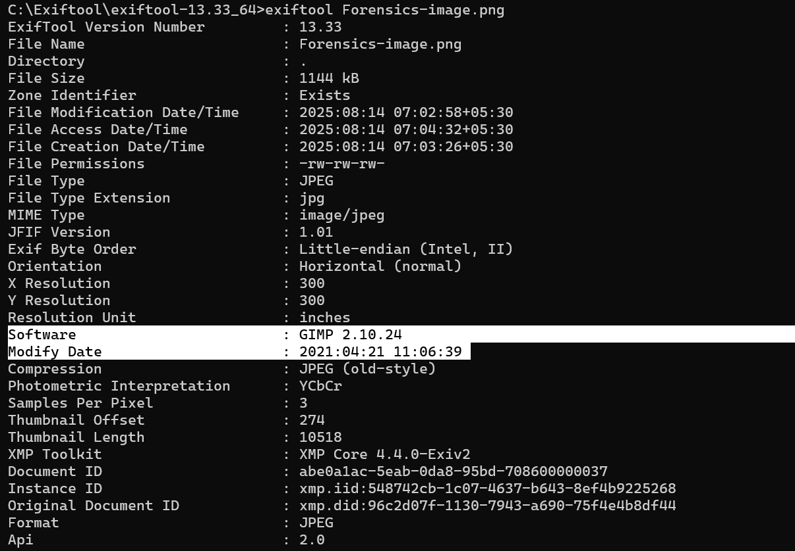
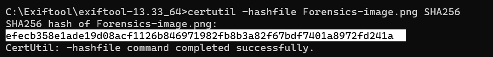

# ExifTool Metadata Analysis Report

## 🔎 Image Overview
- Filename: Forensics-image.png
- File Size: 1144 kB
- Image Dimensions: 1439x753

## 📸 Camera Info
- Make: Not Available
- Model: sRGB

## 🌍 Geolocation (If Available)
- GPS Lat/Long: Not Available
- Maps Link: N/A

## 🕐 Timestamps
- DateTimeOriginal: 2021:03:05 05:59:37+01:00
- ModifyDate: 2021:04:21 11:06:39

## 📝 Software/Comments
- Editing Software: GIMP 2.10.24
- Comment Field: N/A

## 🔐 SHA256 Hash
- efecb358e1ade19d08acf1126b846971982fb8b3a82f67bdf7401a8972fd241a

## 🧠 Inference
The image shows clear signs of modification. The ModifyDate is significantly later than the DateTimeOriginal, and the metadata lists GIMP 2.10.24 as the editing software, indicating that the image was opened and likely altered after its original creation. The absence of camera make/model and GPS data suggests either the image did not originate directly from a camera or metadata has been stripped during editing. Therefore, the image is not in its original state.

## 🖼️ Screenshots

